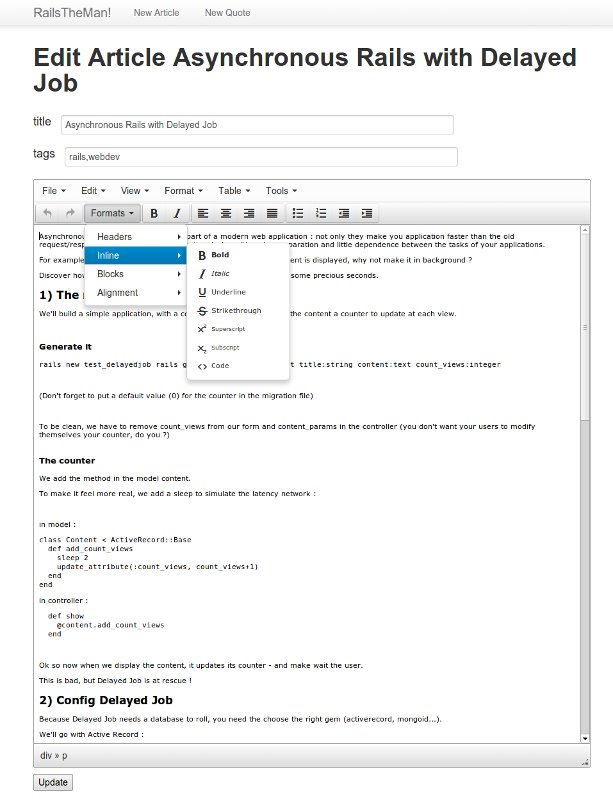

# RailsTheMan !

<a href='http://rubyonrails.org/'>Rails</a> editor for the <a href='http://middlemanapp.com/basics/blogging/'>middleman blog</a>

Have a rich editor to write your articles in middleman and sort them in list.

## Usage

After you have copied this project, define the path to your middleman application (not the blog in your applicaiton) in config/application.rb :

	config.path_application = 'yourpath'

## Features

It uses <a href='http://www.tinymce.com/'>TinyMCE</a> as editor with the gem<a href='https://github.com/spohlenz/tinymce-rails'>tinymce-rails</a>, and <a href='https://github.com/joequery/Stupid-Table-Plugin'>Stupid jQuery Table Sort</a> to sort the articles table.

With my <a href='https://github.com/davidtysman/writetheman'>Writetheman</a> gem to manage the middleman files,

## The Quote

I added a new type of article, the quote :

It uses the header parameters to add the author and source to an article.

To differentiate between the basic article and the quote, it adds 'category' in the header parameters :
it contains 'quote' or 'article' or nothing (your goold old article)

## Business projects

If you need a middleman editor for business, have a look to the Middleman paid extension : 
<a href='http://middleman-blog-editor.awardwinningfjords.com/'>Middleman Blog Editor</a>

## License

MIT, have fun

